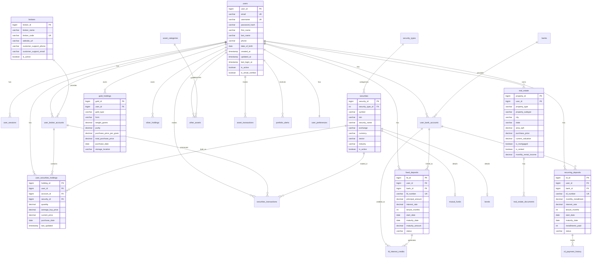

# Entity Relationship Diagram

## Visual Representation (Mermaid)



## Table Relationships Summary

### Core User Tables
| Parent Table | Child Table | Relationship | Foreign Key |
|--------------|-------------|--------------|-------------|
| users | user_sessions | 1:N | user_id |
| users | user_preferences | 1:1 | user_id |
| users | portfolio_alerts | 1:N | user_id |

### Securities & Investments
| Parent Table | Child Table | Relationship | Foreign Key |
|--------------|-------------|--------------|-------------|
| users | user_broker_accounts | 1:N | user_id |
| brokers | user_broker_accounts | 1:N | broker_id |
| user_broker_accounts | user_securities_holdings | 1:N | account_id |
| securities | user_securities_holdings | 1:N | security_id |
| security_types | securities | 1:N | security_type_id |
| securities | mutual_funds | 1:0..1 | security_id |
| securities | bonds | 1:0..1 | security_id |
| users | securities_transactions | 1:N | user_id |
| securities | securities_transactions | 1:N | security_id |

### Banking & Deposits
| Parent Table | Child Table | Relationship | Foreign Key |
|--------------|-------------|--------------|-------------|
| users | user_bank_accounts | 1:N | user_id |
| banks | user_bank_accounts | 1:N | bank_id |
| users | fixed_deposits | 1:N | user_id |
| banks | fixed_deposits | 1:N | bank_id |
| user_bank_accounts | fixed_deposits | 1:N | account_id (optional) |
| fixed_deposits | fd_interest_credits | 1:N | fd_id |
| users | recurring_deposits | 1:N | user_id |
| banks | recurring_deposits | 1:N | bank_id |
| user_bank_accounts | recurring_deposits | 1:N | account_id (optional) |
| recurring_deposits | rd_payment_history | 1:N | rd_id |

### Assets
| Parent Table | Child Table | Relationship | Foreign Key |
|--------------|-------------|--------------|-------------|
| users | gold_holdings | 1:N | user_id |
| users | silver_holdings | 1:N | user_id |
| users | real_estate | 1:N | user_id |
| real_estate | real_estate_documents | 1:N | property_id |
| users | other_assets | 1:N | user_id |
| asset_categories | other_assets | 1:N | category_id |
| users | asset_transactions | 1:N | user_id |

### Analytics & Audit
| Parent Table | Child Table | Relationship | Foreign Key |
|--------------|-------------|--------------|-------------|
| users | audit_log | 1:N | user_id (nullable) |

## Cascade Rules

### ON DELETE CASCADE
These relationships delete child records when parent is deleted:
- users → user_sessions
- users → user_broker_accounts
- users → user_bank_accounts
- users → user_securities_holdings
- users → securities_transactions
- users → fixed_deposits
- users → recurring_deposits
- users → gold_holdings
- users → silver_holdings
- users → real_estate
- real_estate → real_estate_documents
- users → other_assets
- users → asset_transactions
- users → portfolio_alerts
- users → user_preferences
- securities → mutual_funds
- securities → bonds
- fixed_deposits → fd_interest_credits
- recurring_deposits → rd_payment_history

### ON DELETE SET NULL
These relationships preserve child records but remove the reference:
- user_broker_accounts → user_securities_holdings (account_id)
- user_broker_accounts → securities_transactions (account_id)
- user_bank_accounts → fixed_deposits (account_id)
- user_bank_accounts → recurring_deposits (account_id)
- user_bank_accounts → fd_interest_credits (credited_to_account_id)
- users → audit_log (user_id)

## Key Indexes

### Primary Indexes (Automatic)
All tables have a primary key index on their ID column.

### Foreign Key Indexes
```sql
-- User references
CREATE INDEX idx_user_sessions_user_id ON user_sessions(user_id);
CREATE INDEX idx_user_broker_accounts_user_id ON user_broker_accounts(user_id);
CREATE INDEX idx_user_bank_accounts_user_id ON user_bank_accounts(user_id);
CREATE INDEX idx_user_securities_holdings_user_id ON user_securities_holdings(user_id);
CREATE INDEX idx_securities_transactions_user_id ON securities_transactions(user_id);
CREATE INDEX idx_fixed_deposits_user_id ON fixed_deposits(user_id);
CREATE INDEX idx_recurring_deposits_user_id ON recurring_deposits(user_id);
CREATE INDEX idx_gold_holdings_user_id ON gold_holdings(user_id);
CREATE INDEX idx_real_estate_user_id ON real_estate(user_id);
CREATE INDEX idx_portfolio_alerts_user_id ON portfolio_alerts(user_id);

-- Security references
CREATE INDEX idx_securities_type ON securities(security_type_id);
CREATE INDEX idx_user_securities_holdings_security_id ON user_securities_holdings(security_id);
CREATE INDEX idx_securities_transactions_security_id ON securities_transactions(security_id);

-- Bank/Broker references
CREATE INDEX idx_user_broker_accounts_broker_id ON user_broker_accounts(broker_id);
CREATE INDEX idx_user_bank_accounts_bank_id ON user_bank_accounts(bank_id);
CREATE INDEX idx_fixed_deposits_bank_id ON fixed_deposits(bank_id);
CREATE INDEX idx_recurring_deposits_bank_id ON recurring_deposits(bank_id);
```

### Business Logic Indexes
```sql
-- Lookup indexes
CREATE INDEX idx_users_email ON users(email);
CREATE INDEX idx_users_username ON users(username);
CREATE INDEX idx_securities_symbol ON securities(symbol);
CREATE INDEX idx_securities_isin ON securities(isin);

-- Status and date indexes for queries
CREATE INDEX idx_fixed_deposits_status ON fixed_deposits(status);
CREATE INDEX idx_fixed_deposits_maturity_date ON fixed_deposits(maturity_date);
CREATE INDEX idx_recurring_deposits_status ON recurring_deposits(status);
CREATE INDEX idx_securities_transactions_date ON securities_transactions(transaction_date);
CREATE INDEX idx_portfolio_alerts_date ON portfolio_alerts(alert_date);
CREATE INDEX idx_portfolio_alerts_is_read ON portfolio_alerts(is_read);
```

## Data Flow Examples

### Adding a Stock Purchase
1. User places buy order through broker
2. Transaction recorded in `securities_transactions`
3. `user_securities_holdings` updated (quantity, average price)
4. Can query `active_securities_holdings` view for current status

### Creating and Tracking FD
1. User opens FD at bank
2. Entry in `fixed_deposits` table
3. System creates alert in `portfolio_alerts` (30 days before maturity)
4. On interest credit: entry in `fd_interest_credits`
5. On maturity: update status in `fixed_deposits`

### Managing Real Estate
1. User adds property to `real_estate`
2. Upload documents to `real_estate_documents`
3. If rented: track rental income in `real_estate` table
4. System alerts on lease expiry
5. Track appreciation via current_valuation updates

### Portfolio Analytics Flow
1. User accesses dashboard
2. Query `user_portfolio_summary` view
3. Get detailed breakdowns from specific views:
   - `active_securities_holdings`
   - `active_fixed_deposits`
   - `total_gold_holdings`
   - `real_estate_portfolio`
4. Calculate total portfolio value across all asset classes

---

**Last Updated**: 2025-10-22  
**Diagram Format**: Mermaid ERD
